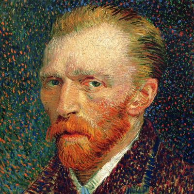

# Alan Turing

* English mathematician, computer scientist, logician and  cryptanalyst
* highly influential in the development of theoretical computer science
* developed the concepts of algorithm and computation with the Turing machine

# Vincent van Gogh

* Dutch Post-Impressionist painter
* Created about 2,100 artworks
* Struggled with severe depression and poverty
* Committed suicide at age thirty-seven

